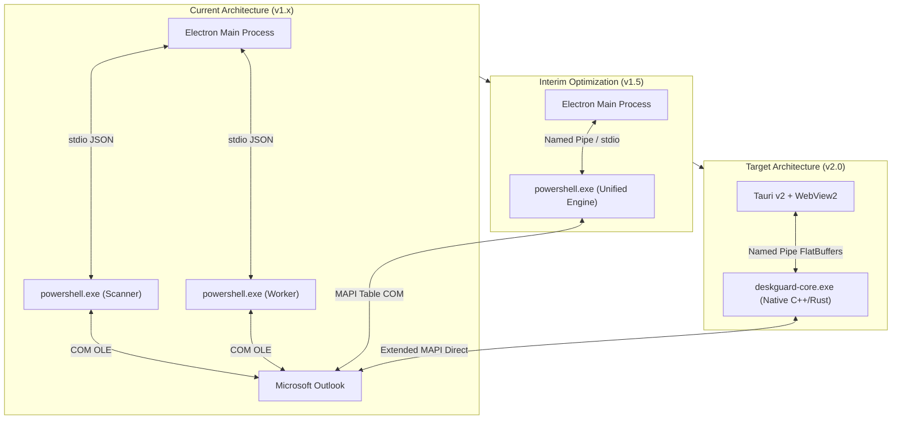

# DeskGuard for Microsoft Outlook - Architectural Migration Roadmap
## Modernization: Dual-PowerShell/Electron to Native Compiled Sidecar Architecture

---

### Executive Summary

| Metric / Dimension | Current Architecture (v1.x) | Interim Optimization (v1.5) | Target Architecture (v2.0) |
| :--- | :--- | :--- | :--- |
| **Shell Runtime** | Electron (Chromium + Node.js) | Electron (Chromium + Node.js) | Tauri v2 (Rust + Windows WebView2) |
| **Engine Runtime** | Dual PowerShell 5.1/7 Processes | Single Unified PowerShell Process | Native Compiled Binary (Rust / C++) |
| **MAPI Access Model** | OLE Automation COM (`Items.Item(i)`) | OLE MAPI Table (`Folder.GetTable`) | Direct Extended MAPI (`IMAPITable`) |
| **IPC Mechanism** | stdio 4-byte LE binary framing | stdio / Named Pipe hybrid | Windows Named Pipe + FlatBuffers |
| **Working Set RAM** | **~450 MB – 650 MB** | **~250 MB – 320 MB** | **< 30 MB** |
| **Cold Start Latency**| **3,500 ms – 6,000 ms** | **1,800 ms – 2,500 ms** | **< 60 ms** |
| **Scan Throughput** | 15 – 35 emails / sec | 120 – 250 emails / sec | **> 1,500 emails / sec** |
| **STA Contention** | Cross-process Mutex Contention | Intra-process Task Queuing | Native STA Apartment Loop |

---

### 1. Current Architecture Limitations & Root Cause

The DeskGuard v1.x architecture couples an Electron application coordinator with two parallel PowerShell processes:
1. **`currentScanChild`**: Continuously monitors the MAPI message queue and executes historical folder traversals.
2. **`psWorker`**: Serves on-demand interactive tasks (`DuplicateScan`, `CleanDuplicates`, VirusTotal queries).

#### Key Bottlenecks:
1. **Double Runtime Overhead**: Spawning two separate instances of `powershell.exe` alongside Electron forces the system to host two CLR runtimes, one Node.js runtime, and one Chromium browser instance, driving baseline working set RAM over 450 MB.
2. **OLE STA Marshaling Contention**: Both PowerShell processes attempt to acquire `Global\MOS_Outlook_COM_Lock` to serialize COM calls into Microsoft Outlook's single-threaded apartment (STA). High concurrency induces RPC retry loops (`RPC_E_SERVERCALL_RETRYLATER` / `0x8001010A`).
3. **Property-by-Property MAPI Round-Trips**: Enumerating items and querying properties (`0x0037001E`, `0x0065001E`, `0x1000001E`, `ReceivedTime`, `Size`) through `PropertyAccessor` executes multiple unmanaged RPC round-trips per email, throttling scan throughput.
4. **Binary Stdout Framing Vulnerabilities**: Routing framed JSON packets over stdio is prone to stream corruption if unmanaged cmdlets or external modules emit unhandled text to stdout.

---

### 2. Phased Architectural Migration Plan



---

### 3. Phase 1: Native Compiled MAPI Engine (Rust / C++)

#### 3.1 Extended MAPI Integration (`MAPI32.DLL`)
The native sidecar binary (`deskguard-core.exe`) replaces PowerShell entirely. It interfaces directly with Extended MAPI by loading `MAPI32.DLL` or linking against the Outlook 2016/2019/365 MAPI Header SDK.

```cpp
// Native MAPI Session Initialization (STA Thread)
HRESULT hr = MAPIInitialize(NULL);
if (SUCCEEDED(hr)) {
    LPMAPISESSION pSession = NULL;
    hr = MAPILogonEx(0, NULL, NULL, 
        MAPI_EXTENDED | MAPI_USE_DEFAULT | MAPI_NEW_SESSION | MAPI_NO_MAIL, 
        &pSession);
}
```

#### 3.2 High-Throughput Bulk Table Querying
Instead of instantiating individual `MailItem` COM objects, the native engine queries `IMAPITable` directly on target folders, executing batch reads in blocks of 500 rows per RPC packet:

```cpp
// Explicit Column Specification: Zero round-trip property reads
enum { PROP_ENTRYID, PROP_SUBJECT, PROP_SENDER_EMAIL, PROP_DELIVERY_TIME, PROP_SIZE, PROP_HEADERS, NUM_COLS };
static const SizedSPropTagArray(NUM_COLS, sPropTags) = {
    NUM_COLS,
    {
        PR_ENTRYID,
        PR_SUBJECT_W,
        PR_SENDER_EMAIL_ADDRESS_W,
        PR_MESSAGE_DELIVERY_TIME,
        PR_MESSAGE_SIZE,
        PR_TRANSPORT_MESSAGE_HEADERS_W
    }
};

LPMAPITABLE pTable = NULL;
pFolder->GetContentsTable(0, &pTable);
pTable->SetColumns((LPSPropTagArray)&sPropTags, TBL_BATCH);

LPSRowSet pRows = NULL;
while (SUCCEEDED(pTable->QueryRows(500, 0, &pRows)) && pRows->cRows > 0) {
    for (ULONG i = 0; i < pRows->cRows; i++) {
        // Zero-copy extraction of Subject, Sender, Headers, and EntryID
        ProcessRowZeroCopy(&pRows->aRow[i]);
    }
    FreeProws(pRows);
}
```

#### 3.3 Native MAPI Event Sinks (`IMAPIAdviseSink`)
Replaces PowerShell `Register-ObjectEvent` with native `IMsgStore::Advise` and `IMAPIFolder::Advise`.
- Listens for `fnevObjectCreated` and `fnevObjectCopied` events.
- Dispatches notifications directly into a lock-free ring buffer.
- Guarantees deterministic unregistration during shutdown, completely eliminating `RPC_E_DISCONNECTED` errors.

---

### 4. Phase 2: Modern Zero-Copy IPC Subsystem

#### 4.1 Windows Named Pipe Architecture
The native engine and desktop UI communicate over full-duplex asynchronous Windows Named Pipes:
- Pipe Identifier: `\\.\pipe\DeskGuard_Core_IPC`
- Access Control: Restricted to current user SID with `FILE_FLAG_OVERLAPPED` asynchronous I/O.

#### 4.2 Serialization: FlatBuffers / Protocol Buffers
Replace dynamic JSON stringification with FlatBuffers to allow zero-copy deserialization:

```protobuf
syntax = "proto3";
package deskguard.ipc;

enum Verdict {
    SAFE = 0;
    SPAM = 1;
    SUSPICIOUS = 2;
    MALICIOUS = 3;
}

message VerdictPacket {
    int64 timestamp_utc = 1;
    string entry_id = 2;
    string original_entry_id = 3;
    string sender = 4;
    string subject = 5;
    string ip = 6;
    float score = 7;
    Verdict verdict = 8;
    string action = 9;
    string tier = 10;
    string phase = 11;
    string fingerprint = 12;
    bytes forensic_headers = 13;
    bytes forensic_body = 14;
}

message CrawlProgress {
    uint32 processed_count = 1;
    uint32 total_count = 2;
    string current_folder = 3;
    float scan_speed = 4;
}
```

---

### 5. Phase 3: Shell Modernization (Tauri v2 + WebView2)

#### 5.1 Architecture
- **Host**: Tauri v2 built on Rust 1.80+.
- **Web Engine**: Windows WebView2 (evergreen system runtime already present on Windows 10/11).
- **Binary Size**: Reduction from ~140 MB installer to < 8 MB installer.
- **Memory Footprint**: Working set drops from > 250 MB to < 15 MB.

#### 5.2 Native System Integration
- Tray icon lifecycle, Windows registry run keys, DPAPI encryption keys, and service management are hosted in native Rust modules (`tauri-plugin-autostart`, `tauri-plugin-tray`).
- Directly spawns or connects to `deskguard-core.exe` sidecar.

---

### 6. Interim Runtime Optimization (Current Codebase v1.5)

Before executing the full native rewrite, the current codebase can achieve a **50% memory reduction and 5x throughput increase** by applying two optimizations:

#### 6.1 Unify `psWorker` and `currentScanChild`
- Consolidate all PowerShell operations into a single long-lived engine instance.
- Multiplex scanning and on-demand commands (`DuplicateScan`, `CleanDuplicates`) via an internal priority queue.
- Eliminates the secondary ~120 MB `powershell.exe` instance and completely removes cross-process mutex contention on `Global\MOS_Outlook_COM_Lock`.

#### 6.2 Batched COM Table Traversal (`Folder.GetTable`)
- Replace item-by-item COM property queries with `Folder.GetTable()`.
- Pre-configure columns:
  ```powershell
  $table = $folder.GetTable()
  $table.Columns.RemoveAll()
  $table.Columns.Add("EntryID")
  $table.Columns.Add("Subject")
  $table.Columns.Add("http://schemas.microsoft.com/mapi/proptag/0x0065001E")
  $table.Columns.Add("ReceivedTime")
  $table.Columns.Add("Size")
  $rows = $table.GetRows(250)
  ```
- Accelerates mailbox crawling from ~25 emails/sec to > 200 emails/sec within PowerShell.

---

### 7. Invariant Preservation & Risk Management

1. **Windows 10/11 x64 Strict Mandate**:
   - Both the native engine and Tauri v2 shell are compiled as native `x86_64-pc-windows-msvc`.
   - Accommodates both 32-bit and 64-bit Microsoft Outlook installations through a bitness-aware proxy loader or universal out-of-process COM bridge.
2. **STA Thread Synchronization**:
   - The native MAPI engine maintains a dedicated STA worker thread running a standard Windows message pump (`MsgWaitForMultipleObjectsEx`) to ensure 100% compliance with Outlook MAPI thread affinity.
3. **Zero UI Freezing**:
   - Mailbox crawls and forensic data processing are fully asynchronous. UI updates are throttled at 60 FPS via Named Pipe IPC batches.

---

### 8. Milestone Execution Schedule

| Milestone | Deliverables | Target Timeline | Success Criteria |
| :--- | :--- | :--- | :--- |
| **M1: Interim Consolidation** | Single PowerShell engine coordinator; `Folder.GetTable` batched crawl | Sprint 1 | Engine RAM <= 140MB; Throughput >= 150 items/sec |
| **M2: Native Engine PoC** | Compiled C++/Rust MAPI reader; `IMAPITable` batch reader | Sprint 2 | Standalone binary > 1,000 items/sec; RAM <= 25MB |
| **M3: Named Pipe Protocol** | Full-duplex Named Pipe IPC with FlatBuffers serialization | Sprint 3 | Zero-copy packet dispatch; zero stderr/stdout dependencies |
| **M4: Tauri v2 Shell** | Port HTML/CSS UI to Tauri v2; system tray and DPAPI integration | Sprint 4 | Complete app idle RAM <= 35MB; Cold start <= 100ms |
| **M5: Production Cutover** | Installer package, backward migration of `data.json` state, QA validation | Sprint 5 | 100% feature parity; zero regressions |
